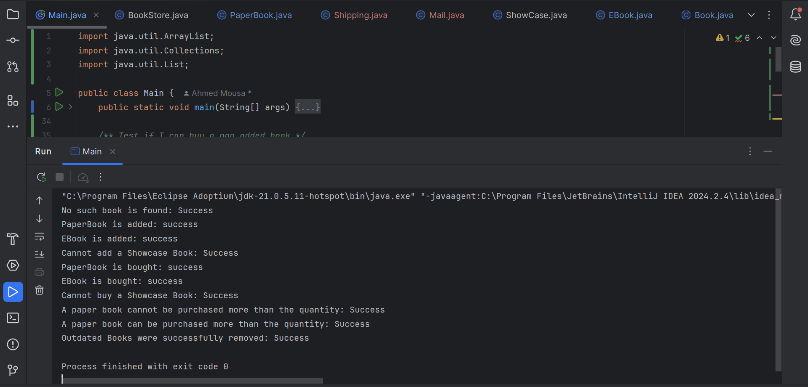

# 📚 BookStore Management System

A simple Java-based bookstore project that demonstrates core OOP concepts like abstraction, inheritance, encapsulation, and package structure. The system supports eBooks, paper books, and showcase items, along with basic customer interactions and inventory management.

---

## ✨ Features

- ✅ Add and remove books (by ISBN)
- 📥 PaperBook inventory tracking
- 📧 EBook delivery simulation (via Mail service)
- 📦 Simulated shipping for PaperBooks
- ❌ Prevent purchase of ShowCase books
- 🧹 Automatically remove outdated books
- 🧾 Purchase tracking using a simple Customer model
- 🧪 Fully testable via the Main.java driver

---

## 📦 Package Structure

The project uses two packages to organize code:

```text
src
├── README.md
├── fawry_pic.png
├── Main.java
└── src/
    ├── model/
    │   ├── Book.java
    │   ├── BookStore.java
    │   ├── EBook.java
    │   ├── PaperBook.java
    │   └── ShowCase.java
    └── service/
        ├── Customer.java
        ├── Mail.java
        └── Shipping.java
```


- model: Contains all book types and the BookStore logic
- service: Contains helper classes like Customer, Mail, and Shipping

---

## 🚀 How to Run (Using IntelliJ)

1. Open the project in IntelliJ
2. Ensure the root folder (e.g., src) is marked as a "Sources Root":
   - Right-click → "Mark Directory as" → "Sources Root"
3. Open Main.java
4. Run the program (click ▶️ or right-click > Run)

---

## 🧪 Sample Output

Here’s a screenshot of the console output showing successful test cases:



---

## 🛠 Future Enhancements

- 🔐 Add customer accounts and login system
- 💾 Store book inventory in JSON or database
- 🖥 GUI version using JavaFX or Swing
- ✅ Add JUnit test cases for automated testing

---

## 📜 License

This project is for educational and demonstration purposes. Feel free to use and extend it.

---